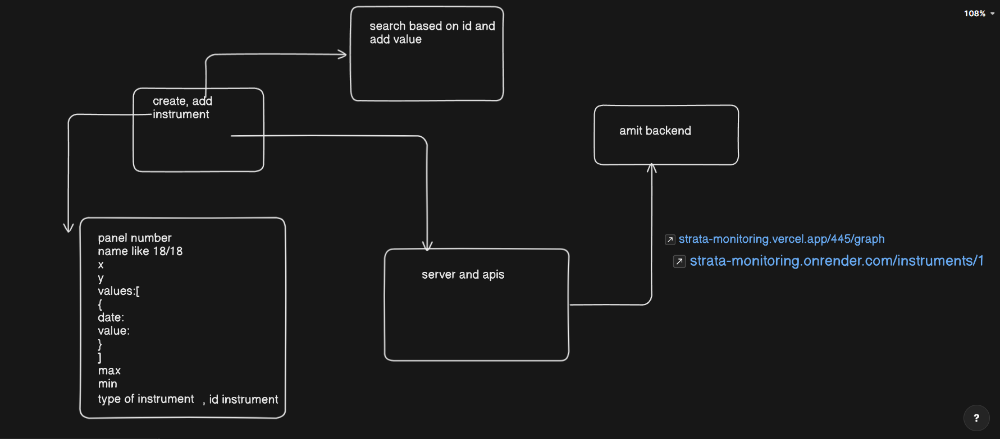
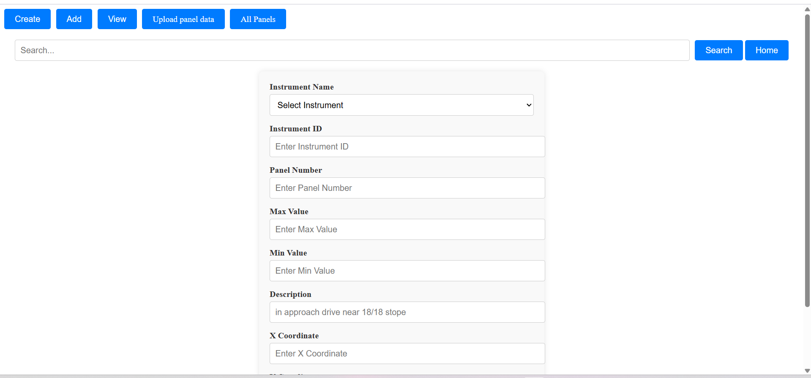
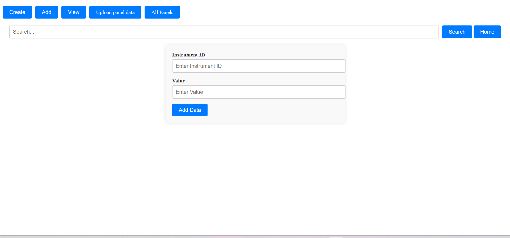
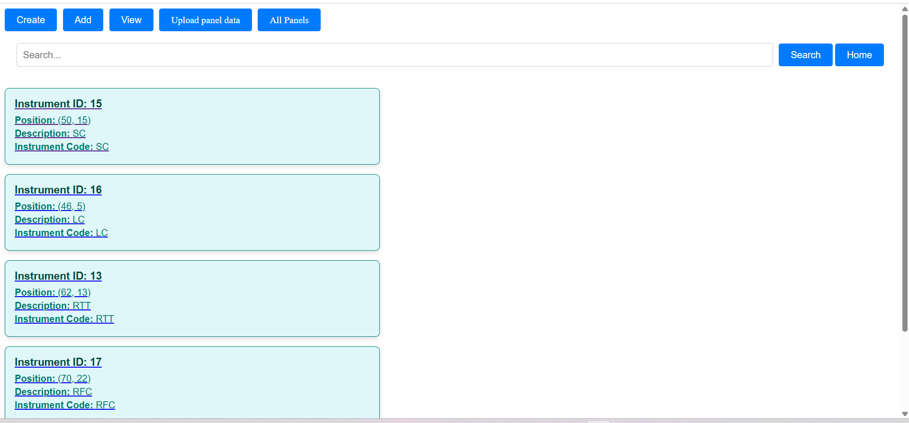
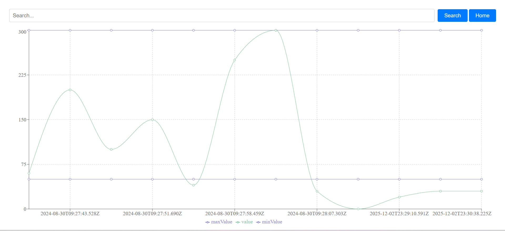
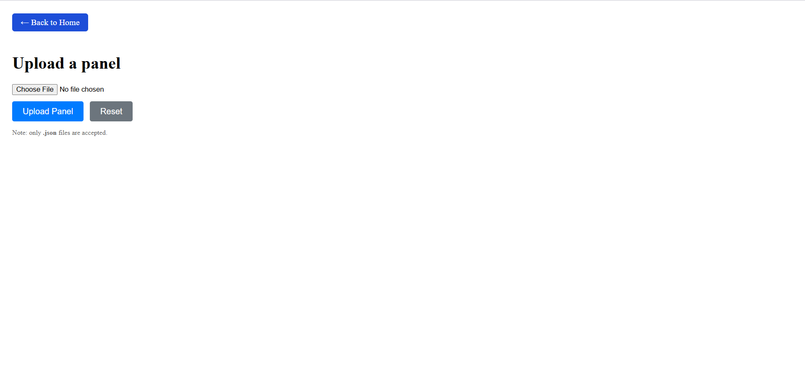
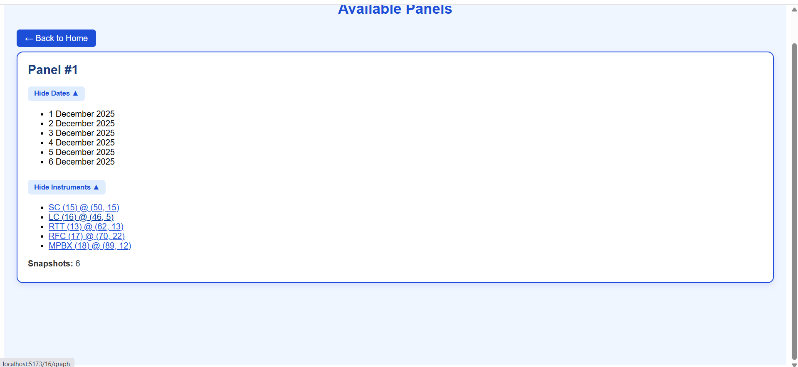

# Strata Monitoring – Board & Pillar Underground Panel Visualization & Monitoring

A web application for visualizing and monitoring underground mining panels using instrumentation data.  
This project replaces the traditional manual method—where workers go underground to collect readings—with a digital, centralized, and scalable monitoring system.

---

## 🚀 Live Deployments

| Service | URL |
|--------|-----|
| Main App (Render) | https://strata-monitoring.onrender.com |
| Main App (Vercel) | https://strata-monitoring.vercel.app |
| Instrument Graph View | https://strata-monitoring.vercel.app/:id/graph |

---
## 🖼️ Panel Visualization  

### **Strata Monitoring Visualization**


---

## 📱 App Features & Screenshots

### 1️⃣ Create an Instrument  
Add metadata when a device is installed in the underground panel.



---

### 2️⃣ Add Instrument Readings  
Log time-based monitoring values to track strata changes.



---

### 3️⃣ View Instruments  
See all instruments in a single searchable interface.
Use the homepage search bar for quick access to any instrument.



---
### 4️⃣  Instrument Graph Visualization  
View plotted readings for any instrument within a panel.



---
### 5️⃣ Upload Panel JSON  
Upload panel geometry and status data.



---

### 6️⃣ Panel List View  
Browse all panels, their metadata, and statuses.



---

## 🔮 Future Implementation

With access to real mining data and hardware resources, the project can evolve into a full **real-time strata monitoring system**, including:

- IoT sensor integration  
- Automatic data ingestion  
- Roof-fall and pillar-failure prediction models  
- Pressure & displacement heatmaps  
- Alert/threshold notification system  
- Real-time control-room dashboard  

---

## 🧑‍💻 Local Setup

```bash
git clone <repository-url>
cd strata-monitoring
npm install
npm run dev
```

## 📌 Overview

This application allows users to:

- Create and manage **instruments** installed inside underground panels.  
- Add and visualize **instrument readings** over time using graphs.  
- Upload **panel JSON files** to generate 2D panel visualizations.  
- Inspect **pillar conditions**, extraction statuses, and associated instruments.  
- Search for instruments by ID from the dashboard.  
- View a list of all panels and drill down into individual instruments.

This project is an early version of a complete real-time strata monitoring system that can eventually integrate IoT sensors and ML-based prediction if resources and real field data become available.

---

## 🧩 Data Format Assumption

Uploaded panel data **must** follow the exact structure:

```json
{
  "panelNumber": 1,
  "date": "2025-12-06T08:00:00Z",
  "panelStatus": "completed",
  "pillars": [
    { "pillarNumber": 1, "coordinates": [ { "x": 5, "y": 5 }, { "x": 7, "y": 5 }, { "x": 7, "y": 8 }, { "x": 5, "y": 8 } ], "status": "extracted" },
    { "pillarNumber": 2, "coordinates": [ { "x": 8, "y": 5 }, { "x": 10, "y": 5 }, { "x": 10, "y": 8 }, { "x": 8, "y": 8 } ], "status": "extracted" },
    { "pillarNumber": 3, "coordinates": [ { "x": 11, "y": 5 }, { "x": 13, "y": 5 }, { "x": 13, "y": 8 }, { "x": 11, "y": 8 } ], "status": "extracted" },
    { "pillarNumber": 4, "coordinates": [ { "x": 14, "y": 5 }, { "x": 16, "y": 5 }, { "x": 16, "y": 8 }, { "x": 14, "y": 8 } ], "status": "extracted" },
    { "pillarNumber": 5, "coordinates": [ { "x": 17, "y": 5 }, { "x": 19, "y": 5 }, { "x": 19, "y": 8 }, { "x": 17, "y": 8 } ], "status": "failed" }
  ],
  "instrumentIds": ["15", "16", "17", "18"],
  "notes": "Panel depillaring completed. Monitoring continues on failed pillar."
}
```
## Requirements

- All **x/y coordinates** must come from the same reference origin.  
- Each **pillar must include four coordinate points** forming a polygon.  
- Valid pillar statuses include: `extracted`, `failed`, `intact`, etc.  
- **Instrument IDs** listed in the panel JSON must match instruments created in the app.

---

## 🖼️ Panel Visualization  
A visual representation of the uploaded panel (pillars + statuses) is generated.
